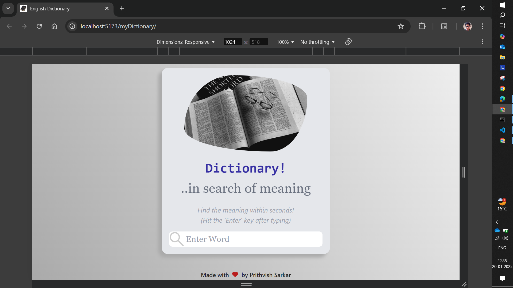
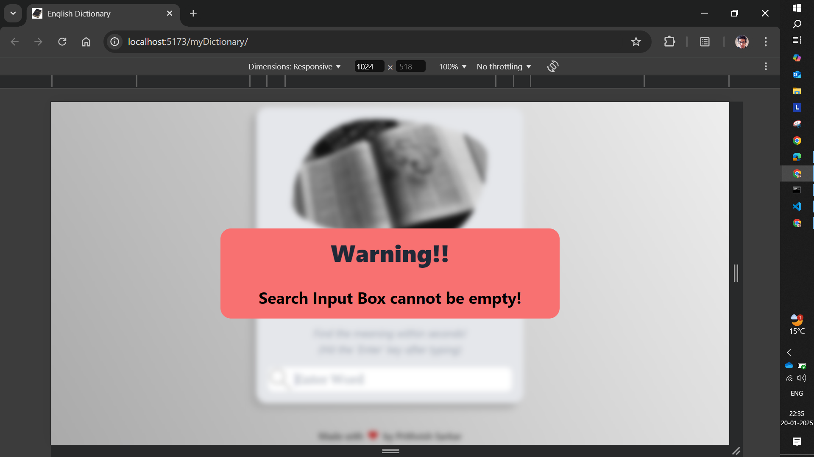
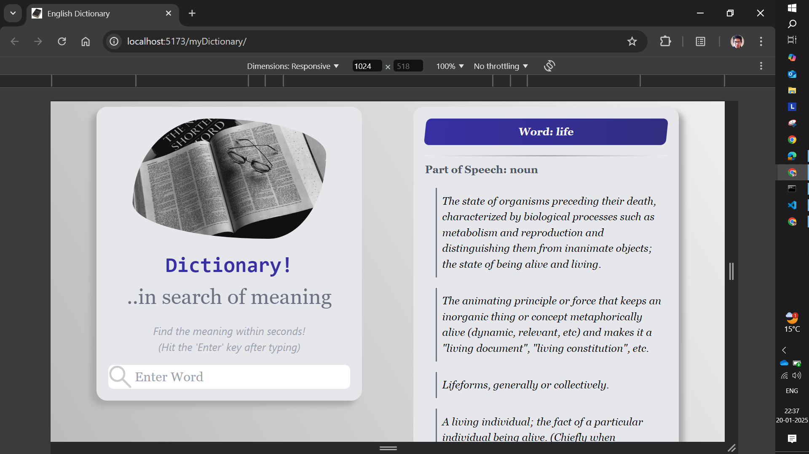
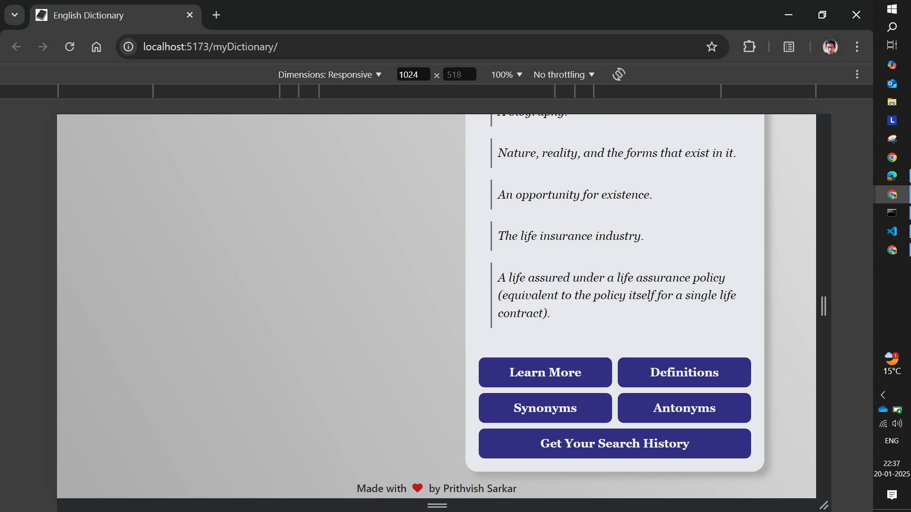
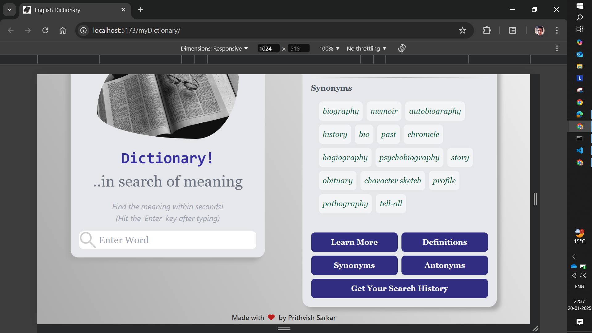
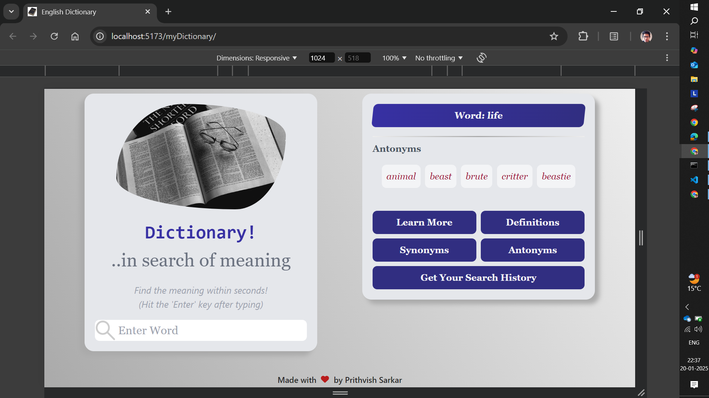
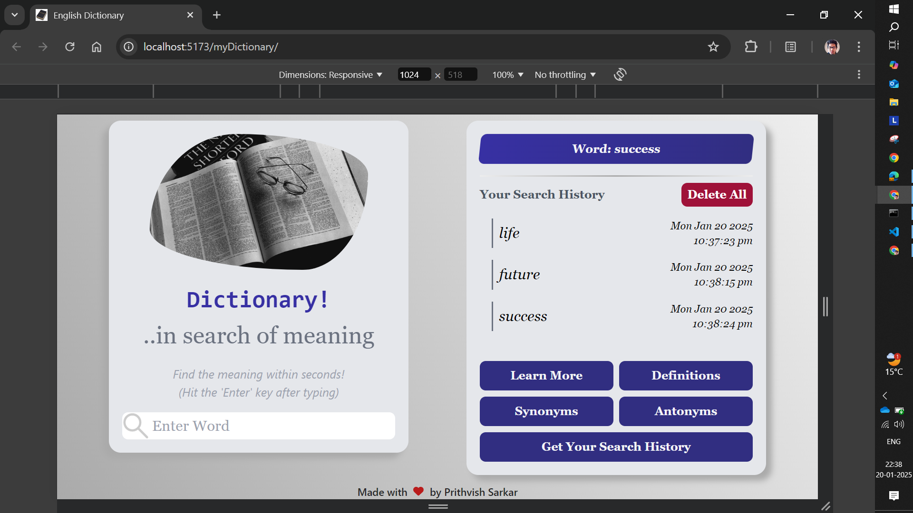
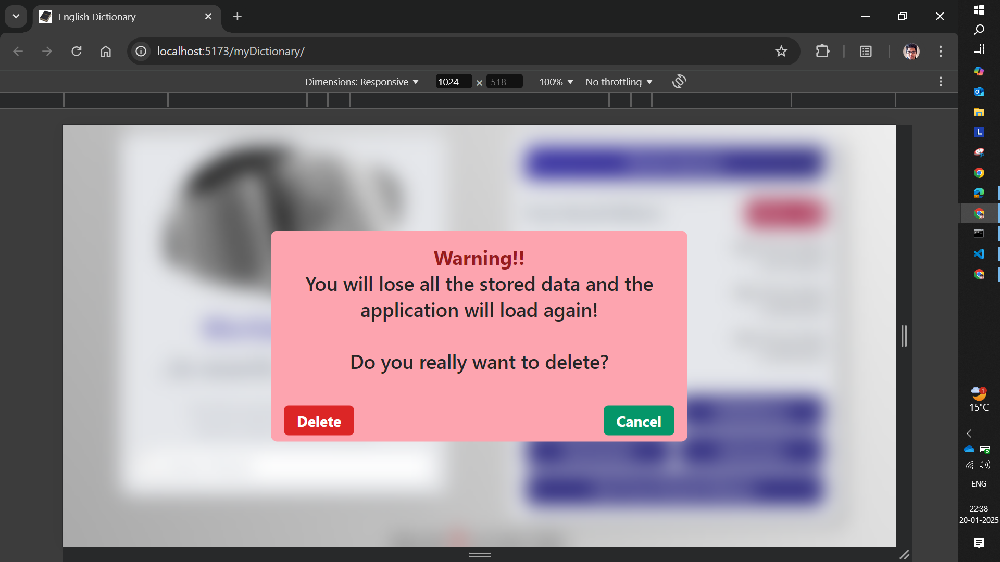
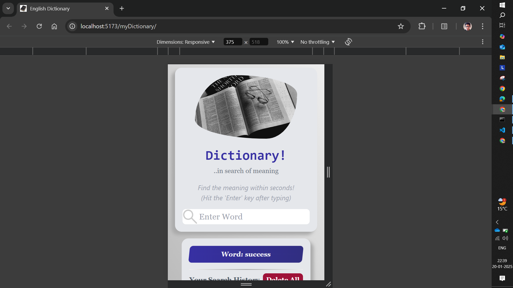
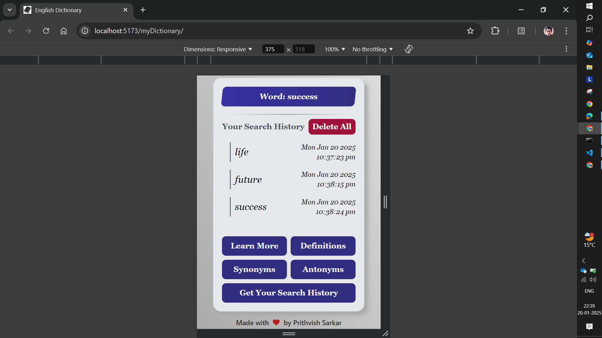

# Dictionary Application

The Dictionary Application is a user-friendly tool designed to help users look up the meanings of words quickly and effectively. With its clean interface and functional design, it is perfect for learners, book readers, and anyone who wants to improve their English vocabulary.

## User Interface of the App

- **Input Box**

  - Displays the *App Image Logo* and an introductory message to engage users upon loading the application
  - Includes a search box where users can enter a valid English word
  - When the user hits the *Enter* button, the searched word, along with the *date* and *time*, is sent to a *MongoDB Atlas*

- **Output Box**

  - Displays the searched word at the top
  - Groups definitions by their *Part of Speech* (e.g., noun, verb, adjective) for clarity
  - Provides comprehensive meanings for the entered word
  - Includes five buttons at the bottom:
    - Learn More
    - Definitions
    - Synonyms
    - Antonyms
    - Get Your Search History

- **Boxes within Output Boxes**
  - **Definitions Box**: Displays definitions categorized by *Part of Speech* and is displayed by default or when the user clicks the *Definitions* button

  - **Synonyms Box**: Displays all valid *synonyms* of the searched word and is displayed when the user clicks on the *Synonyms* button

  - **Antonyms Box**: Displays all valid *antonyms* of the searched word and is displayed when the user clicks on the *Antonyms* button

  - **Search History Box**:
    - Displays the user's history of searched words till now
    - It also contains a *Delete All* button clicking on which pops up a *Delete Data Modal*
    - *Search History* is delete if the user clicks on *Delete* button in the *Delete Data Modal*
    - Data is fetched from the *MongoDB Atlas* database and is displayed in the *Search History Box* when the user clicks on *Get Your Search History* button

    - A *Spin Loader* is shown while data is being fetched which visually notifies the user that the data is loading

- **"Learn More" Button**

  - Located at the bottom of the Output Box
  - Redirects users to the word's Wikipedia Page
  - Provides additional information such as
    - Pronunciation
    - Etymology
    - Hyponyms
    - Derived Terms
    - Translations

## Notable Features of the App

- **Word Search**:
  - Users can type a valid English word in the *Search Box*
  - Press *Enter* to get *definition(s)*, *synonym(s)* and *antonym(s)* via API calls
  - The searched word is also saved in the database along with the current date and time

- **Empty Search Validation**: If the *Search Box* is empty and *Enter* is pressed, an *Alert Modal* pops up for 3 seconds to alert the user that the input cannot be empty

- **Loading Animation**: When a valid word is searched, a *Spin Wheel Loader* is displayed for about 2.5 seconds while the data is fetched via an API call

- **Definition Grouping**: Once the data is fetched, the *Output Box* organizes and displays the definitions based on their *Part of Speech* for easy understanding

- **Search History**:
  - The app tracks and displays the history of all searched words
  - Users can view the *Search History* and delete it as needed

## Applications in Real Life

- **English Learners**: Enhance vocabulary and language skills
- **Book Readers**: Quickly access accurate word meanings while reading
- **General Users**: Explore the English language and deepen word knowledge

## Tech Stack used

- **Frontend**: ReactJS which is built using Vite
- **Backend**: ExpressJS used along with adequate NPM Packages
- **Database**: MongoDB Atlas for holding a large amount of data
- **API Integration**: Fetch definitions using a reliable third-party dictionary API
- **Styling**: Tailwind CSS for a clean and responsive design

## Installation and Setup

- **Clone the Repository**: `git clone https://github.com/PrithvishSarkar/myDictionary.git`
- **Navigate to the Project Directory**: `cd myDictionary`
- **Setup Frontend**
  - **Navigate to Frontend directory**: `cd Frontend`
  - **Install Dependencies**: `npm install`
  - **Start the Frontend Development Server**: `npm run dev`

- **Setup Backend**
  -**Navigate to Backend directory**: `cd ../Backend`
  -**Install Dependencies**: `npm install`
  -**Start the Backend Development Server**: `npm run dev`

## How to use the Dictionary Application?

- Launch the application, you'll see the **Input Box** with the *App Logo* and a *search box*
- Enter a valid English word and press **Enter**
  - If the input is empty, an *Alert Modal* will warn you for 3 seconds
  - If the input is valid, a *Spin Loader* will appear while the definitions are fetched

- View the definitions grouped by **Part of Speech** in the **Output Box**
- Click the **Synonyms** button to view all valid synonyms of the searched word
- Click the **Antonyms** button to view all valid antonyms of the searched word
- Click the **Get Your Search History** button to view all the words you have searched
- You can delete your entire search history by clicking *Delete All* button
- Your *Search History* will be deleted after confirmation via a *Delete Data Modal*
- Click the **Learn More** button to explore the word further on its **Wikipedia Page**

## Instances of the App

## Acknowledgements

- **ReactJS Documentation**: [ReactJS](https://react.dev/learn)
- **TailwindCSS Documentation**: [TailwindCSS](https://tailwindcss.com/docs/installation)
- **ExpressJS Documentation**: [ExpressJS](https://expressjs.com/)
- **MongoDB Documentation**: [MongoDB Atlas](https://www.mongodb.com/docs/atlas/getting-started/)
- **Mongoose Documentation** [Mongoose](https://mongoosejs.com/docs/)
