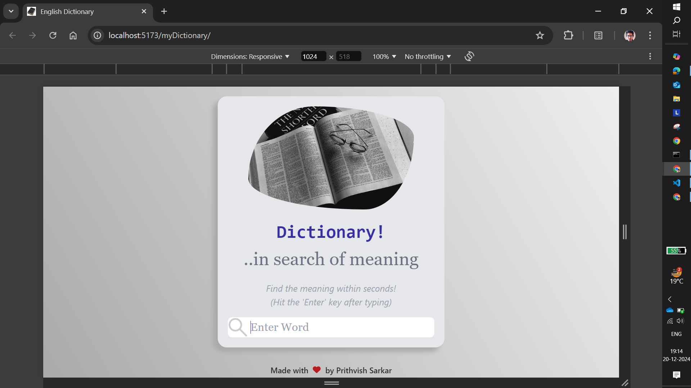
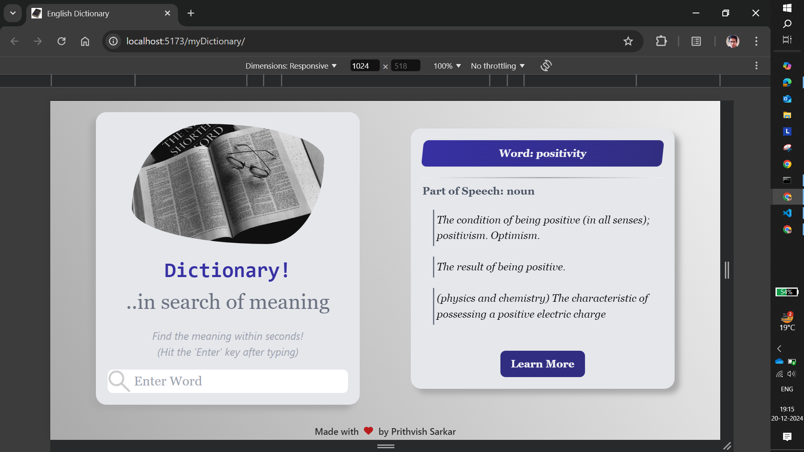
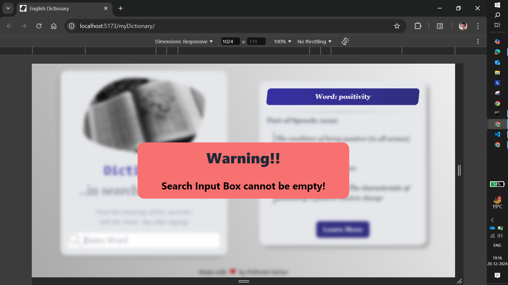
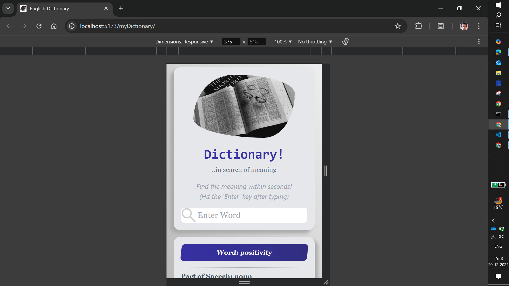
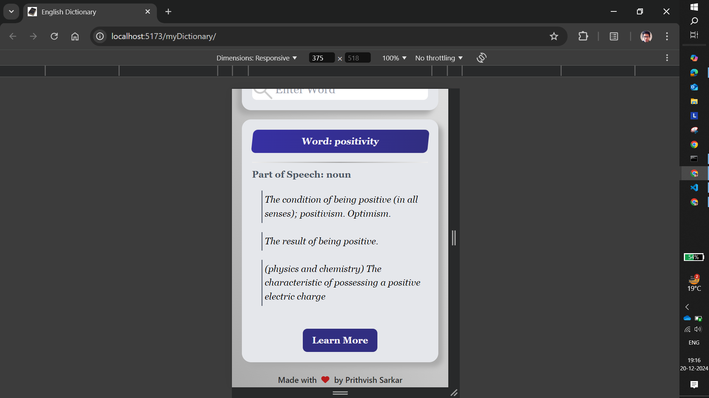

# Dictionary Application

The Dictionary Application is a user-friendly tool designed to help users look up the meanings of words quickly and effectively. With its clean interface and functional design, it is perfect for learners, book readers, and anyone who wants to improve their English vocabulary.

## User Interface of the App

- **Input Box**

  - Displays the *App Image Logo* and an introductory message to engage users upon loading the application
  - Includes a search box where users can enter a valid English word

- **Output Box**

  - Displays the searched word at the top
  - Groups definitions by their *Part of Speech* (e.g., noun, verb, adjective) for clarity
  - Provides comprehensive meanings for the entered word

- **"Learn More" Button**

  - Located at the bottom of the Output Box
  - Redirects users to the word's Wikipedia Page
  - Provides additional information such as
    - Pronunciation
    - Etymology
    - Hyponyms
    - Derived Terms
    - Translations

## Notable Features of the App

- **Word Search**: Users can type a valid English word in the *Search Box* and press *Enter* to fetch the word's definition(s) via an API call
- **Empty Search Validation**: If the search box is empty and *Enter* is pressed, then aa *Alert Modal* pops up for 3 seconds to alert the user that the input cannot be empty
- **Loading Animation**: When a valid word is searched, a *Spin Wheel Loader* is displayed for less than 2 seconds while the data is fetched via an API call
- **Definition Grouping**: Once the data is fetched, the *Output Box* organizes and displays the definitions based on their *Part of Speech* for easy understanding

## Applications in Real Life

- **English Learners**: Enhance vocabulary and language skills
- **Book Readers**: Quickly access accurate word meanings while reading
- **General Users**: Explore the English language and deepen word knowledge

## Tech Stack used

- **Frontend**: ReactJS which is built using Vite
- **API Integration**: Fetch definitions using a reliable third-party dictionary API
- **Styling**: Tailwind CSS for a clean and responsive design

## Installation and Setup

- **Clone the Repository**: `git clone https://github.com/prithvish774848474/myDictionary.git`
- **Navigate to the Project Directory**: `cd myDictionary`
- **Install Dependencies**: `npm install`
- **Start the Development Server**: `npm run dev`

## How to use the Dictionary Application?

- Launch the application, you'll see the **Input Box** with the *App Logo* and a *search box*
- Enter a valid English word and press **Enter**
  - If the input is empty, an *Alert Modal* will warn you for 3 seconds
  - If the input is valid, a *Spin Loader* will appear while the definitions are fetched

- View the definitions grouped by **Part of Speech** in the **Output Box**
- Click the **Learn More** button to explore the word further on its **Wikipedia Page**

## Instances of the App

## Acknowledgements

- **Word Meaning API**: [word](https://api.dictionaryapi.dev/api/v2/entries/en/word)
- **ReactJS Documentation**: [ReactJS](https://react.dev/learn)
- **TailwindCSS Documentation**: [TailwindCSS](https://tailwindcss.com/docs/installation)